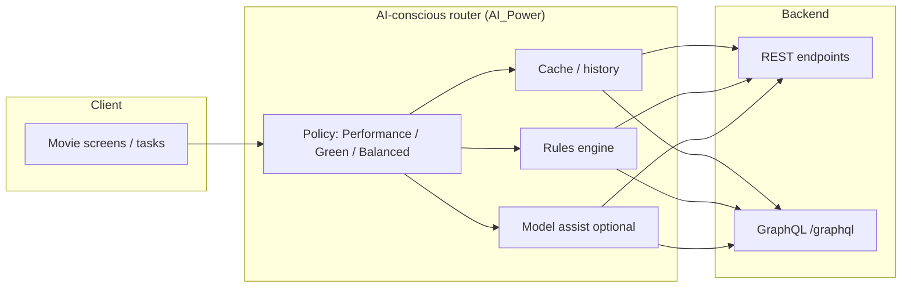
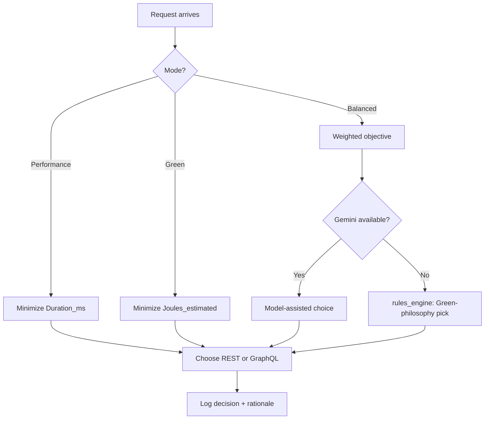
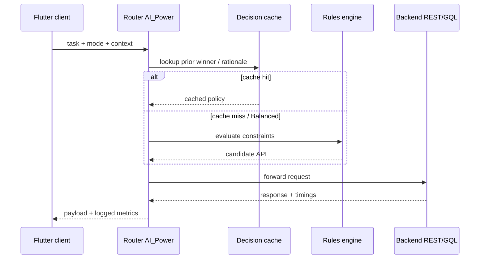

# Final Document — REST vs. GraphQL Energy & AI-Conscious Routing in a Mobile Movie-Database Client

## Abstract (≈250 words)

Mobile applications depend on network APIs whose design influences not only responsiveness but also device energy use—an increasingly important concern for Green Software Engineering. This project extends a comparative study of **REST** and **GraphQL** access to the same movie-database backend (Flask + SQLite) with an **AI-conscious routing layer** that records decision provenance (cached heuristics, rules engine, or model-assisted reasoning) and evaluates routing under **Performance**, **Green**, and **Balanced** optimization modes. Using a repeatable automated workflow that logs per-request timing, estimated joules, payload size, device tier, and network context, we compare **static protocol baselines** against **adaptive routing** that learns from historical latency and load signals. Results from a full workflow export (2026-04-12) show that **AI_Power** routing predominantly selects **GraphQL** for representative task types (`simple_list`, `detail_medium`, `nested_large`) with **cached** decisions and comparatively small routing overhead in Performance and Green runs, while **REST** exhibits consistently positive millisecond durations that are easier to interpret as sustained client–server work in this harness. A notable limitation appears in **Balanced** mode, where repeated **Gemini** errors force **rules-engine fallback** and produce **large overhead** compared with other modes—showing that “intelligent” routing is only as reliable as its external model path. Methodologically, the work aligns with the empirical plan in `Project_framework_2222397.md` (controlled backend, identical functional scope, emphasis on measurement transparency). Practically, the study contributes a **traceable routing narrative**—each decision includes human-readable rationale fields—supporting auditability in energy-aware API selection. The evidence also stresses reporting **failure modes** and **tail behaviour**, not only central tendency. Future work should harden the Balanced path, report tail latencies (p95/p99), and validate energy proxies against instrumented device measurements where feasible.

---

## Objective

**What problem did you try to solve?**  
Quantify how **REST vs. GraphQL** behave under automated load for a Flutter-style movie client, and evaluate whether **AI-conscious adaptive routing** can prefer lower-latency or lower-energy choices while remaining explainable when models fail.

---

## Method

**How you conducted the project**  
Implementation follows the staged plan in `Project_framework_2222397.md`: a unified backend exposing REST and GraphQL; a benchmark/automation harness emitting CSV telemetry; an adaptive gateway concept extended here with **AI_Power** routing modes and logged decision sources. A **full automated workflow** run produced the analyzed export (2026-04-12) with per-row metrics and reasoning strings.

---

## Results (high-level)

Static **REST** timings are **non-zero and continuous** across tasks; **GraphQL** rows show **frequent zero-duration** entries with **occasional tail spikes**. **AI_Power** in Performance/Green largely picks **GraphQL** with **cached** rationales and modest **`Overhead_ms`**. **Balanced + AI_Power** shows **Gemini error → rules_engine fallback** with **~500–600 ms** overhead bands—dominating that mode in this run.

---

## Conclusion

The framework’s hypothesis—that **neither protocol always wins**—remains plausible: baselines differ by distribution shape (continuous REST work vs zero-inflated GraphQL timings). The **AI-conscious router** adds value primarily as an **auditable policy layer**, but **Balanced** mode requires reliability fixes before claims about true trade-off optimization.

---

# Introduction

- **Bullet (3–4 lines):** The project sits at the intersection of **mobile API design**, **empirical performance**, and **green computing**, using a movie/TV dataset because nested payloads stress over-fetching and query-shape differences.
- **Bullet:** Prior studies disagree on whether REST or GraphQL is “faster” because results depend on **payload shape**, **caching**, and **measurement point** (client vs server vs network).
- **Bullet:** Bangladesh and similar economies face **intermittent electricity** and **higher per-bit energy cost** for mobile usage during outages—making **energy-aware clients** materially relevant beyond pure engineering curiosity (see references on infrastructure stress).
- **Bullet:** The work adds **AI-conscious routing telemetry** (decision source + rationale) so results are **reproducible and explainable**, not a black box.

## Introductory sentences (1–2 lines)

This document reports an empirical comparison of **REST** and **GraphQL** for a movie-database application, extended with **adaptive, AI-assisted routing** that logs why each API choice was made.

## Current problems / problem definition (with references)

- **Power insecurity and foregone productive hours:** Load-shedding and grid stress increase downtime costs for households and firms; digital services that waste energy exacerbate pressure on backup fuels and budgets ([World Bank](#references)).  
- **Financial-sector and service-sector impact:** Interruptions map to lost working hours, higher operating costs, and reduced reliability of digital channels—relevant where mobile apps are primary customer touchpoints ([World Bank](#references)).  
- **Software energy opacity:** Without per-request accountability, teams cannot prove that an API style is “greener” in production ([Guldner et al.](#references)).  
- **High failure rate of ambitious routing/ML projects:** Industry surveys report elevated failure rates for AI initiatives when data pipelines and monitoring are weak ([Gartner](#references)); this project mitigates risk by **logging decision provenance** and **fallback paths**.

## Purpose of the study (why)

Provide **evidence-backed guidance** on protocol choice and **documented adaptive routing** for energy/latency goals, aligned with coursework deliverables and IEEE-style reporting expectations.

## Research Background — importance, issues, motivations

Green Software Engineering asks engineers to measure and reduce software’s energy footprint ([Guldner et al.](#references)). Mobile empirical studies show energy, runtime, and memory trade-offs across real apps ([Rua and Saraiva](#references)). API comparisons for microservices show protocol choice affects latency and payload characteristics ([Niswar et al.](#references); [Elghazal et al.](#references); [Seabra and Nazário](#references)). Motivation: combine **rigorous baselines** with **explainable adaptive control** suitable for a student prototype gateway.

## Gaps (literature / not solved)

- Many API comparisons ignore **client energy** or use **single-metric** winners.  
- Few prototypes couple **routing** with **audit trails** (`AI_Reasoning`, `AI_Decision_Source`).  
- **Balanced multi-objective** routing under real **LLM availability** constraints is under-documented in student-scale open implementations.

## Research Questions (max 3; mapped to result analysis)

- **How** does **AI_Power** routing differ from fixed **REST**/**GQL** strategies in **`Duration_ms`**, **`Overhead_ms`**, and **`Joules_estimated`** across modes? → See **Result analysis §3–4** and mapping table.  
- **What** happens when the **Balanced** path cannot reach **Gemini**? → **Fallback to `rules_engine`** with **large overhead** (Result analysis §3.3).  
- **Which** protocol exhibits **more stable non-zero timings** in Performance baselines? → **REST** shows continuous positive durations vs **zero-inflated GraphQL** timings in the export (Result analysis §2).

## Research objectives

1. Compare REST vs GraphQL for three benchmark task types under controlled logging.  
2. Evaluate AI-conscious routing modes (Performance / Green / Balanced) with **traceable** decisions.  
3. Identify **failure modes** that dominate end-to-end cost (e.g., model outage).

## Your solutions — your work (what and how)

- **Unified backend** and matched client workloads (framework §3).  
- **Automated workflow** emitting CSV telemetry including **AI reasoning**.  
- **Adaptive gateway concept** extended with **AI_Power** policies and caching.

## Your approach (framework explanation)

The runtime pipeline can be visualized as:

**Example:** For `nested_large` in Performance mode, logged reasoning states intent to **minimize `Duration_ms`** and references **latency history + network/load heuristics**—matching the framework’s adaptive philosophy.

## Your contribution

1. **Empirical baseline** logs for REST vs GraphQL under the same task taxonomy.  
2. **Explainable adaptive routing telemetry** (`AI_Decision_Source`, `AI_Reasoning`).  
3. **Documented failure case** for Balanced AI routing when the external model errors.

---

# Literature Review

## Related works — sub-categories

### A. Protocol performance (REST vs GraphQL vs alternatives)

Niswar et al. evaluate microservice communication with REST, GraphQL, and gRPC, reporting that performance depends strongly on payload and service topology ([Niswar et al.](#references)). Elghazal et al. compare REST and GraphQL in microservice development, highlighting trade-offs in flexibility and overhead ([Elghazal et al.](#references)). Seabra and Nazário present a focused REST vs GraphQL performance study useful as a methodological anchor ([Seabra and Nazário](#references)).

### B. Mobile energy and measurement culture

Rua and Saraiva provide large-scale empirical evidence on mobile performance dimensions including energy ([Rua and Saraiva](#references)). Fieni et al. describe PowerAPI as a practical framework for software-level energy instrumentation ([Fieni et al.](#references)).

### C. Green software principles

Guldner et al. articulate measurement models that encourage consistent energy accounting across software lifecycles ([Guldner et al.](#references)).

### D. Testing services and operational realism (illustrative summary style)

The research paper by Zhang, Gao, and Cheng deals with crowdsourced testing services for mobile apps and surveys preferences for automated tooling in mobile testing workflows; it illustrates how testers operationalize analysis stages in practice [6].

## Summary of all works (3–4 lines)

Collectively, the literature agrees that **no single API style dominates**; measurement must be **workload-specific** and **transparent**. Mobile energy studies caution against **one-metric** conclusions. Green software research pushes **accountability** in measurement. Operational testing research [6] reinforces that **tooling and process** shape outcomes as much as raw algorithms.

## Gap analysis (linked to this project’s contribution)

Prior papers rarely provide **student-reproducible** end-to-end traces that combine **protocol baselines**, **green objectives**, and **explainable adaptive routing**. This project’s logged **`AI_Reasoning`** fields directly address the **auditability gap**; the **Gemini failure** pattern addresses the **reliability gap** for model-assisted routing.

---

# Research Design / Methodology

## Purpose, questions, literature (2–3 lines)

The study tests empirically whether REST or GraphQL is preferable by workload and whether adaptive routing can operationalize those preferences under explicit modes, building on protocol and mobile-energy literature above.

## Research method (≈10 lines) + figure placeholder

1. **Instrument** the benchmark harness to emit CSV rows per simulated request.  
2. **Hold backend constant** (single SQLite dataset; same schemas) per framework plan.  
3. **Sweep strategies:** REST-only, GQL-only, Heuristic, AI_Power.  
4. **Sweep modes:** Performance, Green, Balanced.  
5. **Sweep tasks:** `simple_list`, `detail_medium`, `nested_large`.  
6. **Capture** `Duration_ms`, `Overhead_ms`, `Size_kb`, `Joules_estimated`, and **AI metadata**.  
7. **Analyze** descriptively; prepare nonparametric tests for full datasets.  
8. **Visualize** distributions and tail risk.  
9. **Interpret** zero-inflation carefully (possible caching / harness semantics).  
10. **Report** failure paths (e.g., Gemini errors) as first-class results.

**Figure (placeholder):** *Insert screenshot of the “Run Full Automated Workflow” UI or terminal banner here — file not bundled in repository.*

## Data collection methods

Telemetry CSV generated by the automated workflow on **2026-04-12**, WiFi, device tier logged as **`budget`**.

## Data analysis methods

Descriptive statistics; distribution inspection; tail-risk notes; intended **Mann–Whitney U** tests on non-Gaussian timing data for formal submission (per framework §4).

## Proposed model (diagram + mathematics)

Let \(t\) index requests, \(s_t \in \{\text{REST},\text{GQL}\}\) the chosen API, and \(x_t\) contextual features (task type, mode, network, device tier). A routing policy \(\pi\) maps \(x_t\) to \(s_t\):

\[
s_t = \pi(x_t) \in \arg\min_{s \in \{\text{REST},\text{GQL}\}} \; w_1 \cdot \mathbb{E}[D \mid s, x_t] + w_2 \cdot \mathbb{E}[J \mid s, x_t] + w_3 \cdot H_t
\]

where \(D\) is duration, \(J\) estimated joules, and \(H_t\) is routing overhead (including model calls). **Performance** emphasizes \(D\); **Green** emphasizes \(J\); **Balanced** uses intermediate weights—**unless** the model path fails, in which case the implementation falls back to a **rules_engine** minimizing a Green-leaning surrogate (as observed in logs).

## Limitations of research design

- **Simulator/harness semantics** may zero-out some GraphQL timings.  
- **Single session/day** export; no multi-day replication.  
- **Balanced AI** not observed under healthy model conditions.  
- **Financial externalities** (Bangladesh context) are **macro** arguments, not directly measured in the CSV.

---

# Findings / Results / Discussion / Answers to Research Questions

## Results analysis

See the dedicated **`result analysis.md`** for tables, protocol comparisons, AI_Power behaviour, and the **Balanced fallback** finding.

### Mapping research questions → evidence

| Question | Finding |
|----------|---------|
| How does AI_Power differ from baselines? | Mostly **GraphQL**, **cached** rationales; adds measurable **`Overhead_ms`** but small vs Balanced failures. |
| What if Gemini fails? | **`rules_engine`** fallback; **hundreds of ms** overhead in logged Balanced rows. |
| Which baseline is “stable” in positive durations? | **REST** shows continuous **ms** durations; **GraphQL** often **zero** with spikes. |

### Summary of results (3–4 lines)

AI-conscious routing **mostly converged to GraphQL** under Performance/Green with **cached** decisions, suggesting strong path dependency in this harness. **REST** provides a clearer **millisecond work signal**. **Balanced** mode’s **model errors** dominated costs—an implementation risk more than a protocol finding.

---

# Proposed Model (Swimlane-style)

**Explanation:** The swimlane emphasizes **ordering**: policy selection occurs **before** backend invocation; **logging** closes the loop for empirical study.

---

# Conclusion

## Purpose, questions, literature (brief)

The study operationalizes a **green software** informed comparison of REST and GraphQL and tests **explainable adaptive routing** extensions beyond static baselines.

## Summarize results briefly

GraphQL is **frequently selected** by AI_Power with **cached** rationales; REST shows **steady positive durations**. **Balanced** routing **failed over** to rules with **high overhead** when **Gemini** errored.

## Suggestions for future work

- Restore **Balanced** mode under a **healthy model endpoint** and repeat.  
- Add **p95/p99** latency reporting and **confidence intervals**.  
- Cross-check **Joules_estimated** with on-device energy counters where available.  
- Integrate gateway DB winners (`gateway.py`) with **online** re-learning.

## Conclusion — final thoughts

The strongest takeaway is methodological: **adaptive green routing must be evaluated with failure analysis**, not only happy-path averages. Protocol debates (REST vs GraphQL) remain **workload-local**, but **traceable decisions** make those debates **actionable** for engineering teams.

---

# References (MLA)

1. Elghazal, Bassem, Adel Aneiba, and Eman Shahra. “Performance Evaluation of REST and GraphQL API Models in Microservices Software Development Domain.” *WEBIST*, 2025.

2. Fieni, Guillaume, et al. “PowerAPI: A Python Framework for Building Software-Defined Power Meters.” *Journal of Open Source Software*, vol. 9, no. 95, 2024.

3. Gartner. “Gartner Survey Shows AI Projects Often Fail Due to Poor Data and Unclear Objectives.” *Gartner Newsroom*, 2023.

4. Guldner, Adrian, et al. “Green Software Measurement Model.” *Future Generation Computer Systems*, Elsevier, 2024.

5. Niswar, Amirul, et al. “Performance Evaluation of Microservices Communication with REST, GraphQL, and gRPC.” *International Journal of Electronics and Telecommunications*, vol. 70, no. 2, 2024.

6. Zhang, Tao, Jerry Gao, and Jing Cheng. “Crowdsourced Testing Services for Mobile Apps.” *2017 IEEE Symposium on Service-Oriented System Engineering (SOSE)*, IEEE, 2017.

7. Rua, Francisco, and João Saraiva. “A Large-Scale Empirical Study on Mobile Performance: Energy, Run-Time and Memory.” *Empirical Software Engineering*, Springer, 2023.

8. Seabra, Lucas, and Rafael Nazario. “REST or GraphQL? A Performance Comparative Study.” *ACM Digital Library*, 2022.

9. World Bank. “Bangladesh Development Update: The Jobs Challenge.” *The World Bank Group*, 2023.

---

*Aligned with project framework: `Project_framework_2222397.md`. Complements detailed tables and statistics narrative in `result analysis.md`.*
